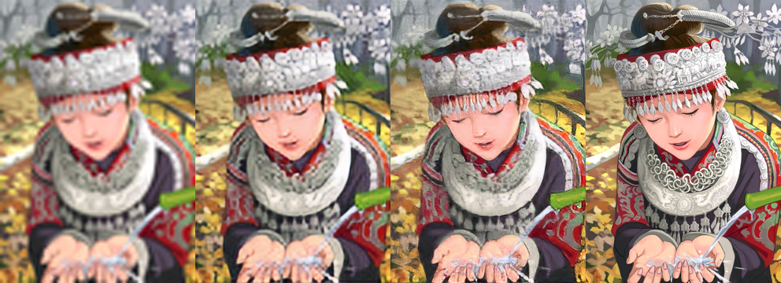

# SRGAN-TensorFlow
Implementation of SRGAN using Tensorflow

original paper: https://arxiv.org/abs/1609.04802

## Usage 

1. Download vgg19.npy from [here.](https://github.com/machrisaa/tensorflow-vgg)

  Put vgg19.npy in the folder where convert.py and convert.py are located.
  
  like this
```
...
│
├──convert.py
├──vgg.py
├──vgg19.npy
...
```

  run convert.py.
  
```
python convert.py
```

  after running, A vgg model dedicated to tensorflow will be output.
 
 ```
 ...
│
├── convert.py
├── vgg.py
├── vgg19.npy
├── modelvgg
│     ├── checkpoint
│     ├── model.ckpt-0
│     ├── model.ckpt-0
│     └── model.ckpt-0
...
```

2. Download dataset from [DIV2K dataset.](https://data.vision.ee.ethz.ch/cvl/DIV2K/)

  download the following four.

* Train Data Track 1 bicubic downscaling x4 (LR images)
* Train Data (HR images)
* Validation Data Track 1 bicubic downscaling x4 (LR images)
* Validation Data (HR images)

(If your PC has enough RAM, I recommend also The flickr2K data set proposed in [EDSR.](https://github.com/LimBee/NTIRE2017))

  Put the downloaded dataset in the train_lr, train_hr, val_lr and val_hr folders.
  like this
```
...
│
├── train_lr
│     ├── 0001x4.png
│     ├── 0002x4.png
│     ├── ...
│     └── 0800x4.png
├── train_hr
│     ├── 0001.png
│     ├── 0002.png
│     ├── ...
│     └── 0800.png 
├── val_lr
│     ├── 0801x4.png
│     ├── 0802x4.png
│     ├── ...
│     └── 0900x4.png
├── val_hr
│     ├── 0801.png
│     ├── 0802.png
│     ├── ...
│     └── 0900.png 
├── main.py
├── model.npy
...
```

3. Train SRGAN.

```
python main.py
```

4. After training, inference can be performed.

example:

```
python pred.py foldername
```


## Result examples

leftmost: bicubic upsampling

Second from left: SRResNet(MSE + VGG)

Third from left: SRGAN(MSE + VGG + GAN)

rightmost: original HR image




